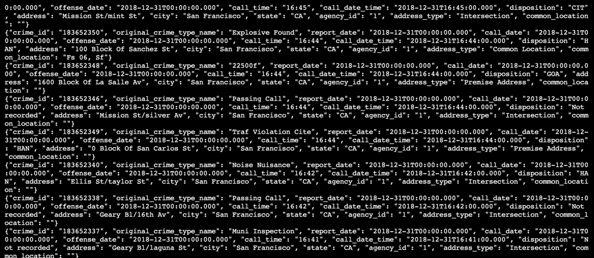

# streaming_course

# To start the project


1. Start zookeeper server in one terminal
```
/usr/bin/zookeeper-server-start config/zookeeper.properties
```

2. Start kafka server in a seperate terminal
```
/usr/bin/kafka-server-start config/producer.properties
```

3. Start producer server in a seperate terminal
```
python kafka_server.py
```

4. Start consumer listener
```
/usr/bin/kafka-console-consumer --bootstrap-server localhost:9092 --topic police.department.calls --from-beginning
```



5. Start Streaming App
```
spark-submit --conf spark.ui.port=3000 --packages org.apache.spark:spark-sql-kafka-0-10_2.11:2.3.4 --master local[*] data_stream.py
```


# Questions:
1. How did changing values on the SparkSession property parameters affect the throughput and latency of the data?

Setting the memory for executors (spark.executor.memory), the more throughput and the lower the latency you see. 

2. What were the 2-3 most efficient SparkSession property key/value pairs? Through testing multiple variations on values, how can you tell these were the most optimal?

spark.default.parallelism - based on the available cores.  I have 4 cores on my machine, so would set this value to 4.  I saw an increase number of batch output displayed in the terminal during similar session runs compared to other.


